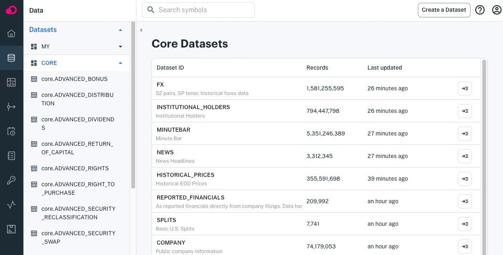
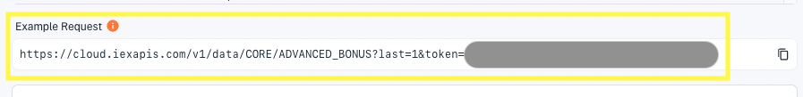

# Using Core Datasets

Apperate has Core Data that is available as datasets for combining with other datasets in views and that is also available to query directly via REST endpoints and the SQL editor. 

The Apperate console lists the Core datasets at [**Data > Datasets > Core**](https://iexcloud.io/console/datasets/core).



You can view a dataset by clicking its name.

## Executing a Dataset's Example Request

Each dataset's **Overview** page provides an example request URL that returns the dataset's last record. You can get a dataset's last record by clicking the **Example Request** URL.



For example, clicking on the **CORE.ADVANCED_BONUS** dataset's **Example Request** returns a record like this:

```javascript
[{"countryCode":"US","created":"2022-02-01","currency":"","description":"Global X MSCI China Industrials ETF","exDate":"2022-12-29","figi":"BBG000PYH302","flag":"","fromFactor":0,"lastUpdated":"2022-02-01","notes":null,"parValue":0,"parValueCurrency":"USD","paymentDate":"2023-01-09","recordDate":"2022-12-30","refid":"2433108","securityType":"Exchange Traded Fund","symbol":"CHII","toFactor":0,"id":"ADVANCED_BONUS","key":"CHII","subkey":"2433108","date":1672272000000,"updated":1652531939424.008}]
```

> **Note:** From a dataset's **Database** page, you can query its data, export the query results to a CSV, and share your query in a URL. 

The example request demonstrates using the `GET /data/...` REST endpoint. 

## Using the GET /data Endpoint to get Core Data

Core Dataset data is available from the `GET /data/...` REST endpoint. Since Core Datasets contain time series data, you can filter on date ranges using time series parameters. 

TODO


---
[Go to Docs Home](https://github.com/iexcloud/docs/blob/main/README.md)